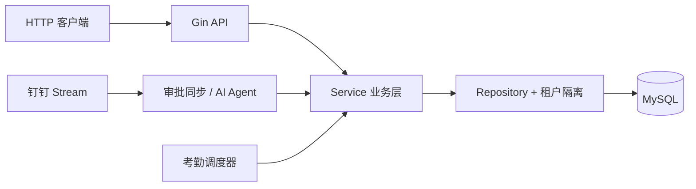

<div align="center">

# Schedule Server

**面向教育与培训团队的多租户课表、考勤与钉钉 AI 助手服务**

将课表管理、考勤统计、请假同步和自然语言查询整合到一个 Go 服务中，帮助团队在钉钉内完成日常教务协作。


[](https://github.com/87hujih/DingDingSchedule/actions/workflows/ci.yml)


</div>

## 项目简介

Schedule Server 是一个围绕钉钉生态构建的排课与考勤后端。它既提供标准 HTTP API，也通过钉钉 Stream 接收审批和聊天消息，让用户可以直接询问课表、空闲人员、考勤结果，或在权限允许时完成群考勤订阅与补签等操作。

项目采用单库多租户架构，按 Handler、Service、Repository 分层组织，并为 Agent 写操作提供权限校验、持久化工作流、幂等控制和恢复机制。


## 核心能力

| 能力 | 说明 |
| --- | --- |
| 📅 课表管理 | 导入 Excel 课表、按周查询、手动维护、复制他人课表 |
| ✅ 考勤统计 | 实时考勤、最终快照、迟到/缺勤统计、周排行、补签与人工覆盖 |
| 🏖️ 请假与休息日 | 同步钉钉审批，管理个人休息日，并自动参与考勤计算 |
| 🕐 作息配置 | 管理学期、节次、上学/假期模式及考勤开关 |
| 💬 群考勤推送 | 按群和部门订阅考勤结果，支持开启、取消与状态查询 |
| 🤖 AI 助手 | 通过自然语言查询课表、空闲人员、考勤、请假和统计数据 |
| 🏢 多租户隔离 | 基于 `tenant_id` 与 GORM 插件隔离组织数据 |
| 📈 可观测性 | 健康检查、Agent 就绪状态、Prometheus 指标、Grafana 与告警 |

## 工作方式



HTTP API 负责登录、课表、考勤和系统设置；钉钉 Stream 负责审批事件与 AI 对话；考勤调度器根据当前作息自动生成实时和最终统计。

## 技术栈

- **后端**：Go 1.24、Gin、GORM、MySQL 8
- **集成**：DingTalk OpenAPI、DingTalk Stream SDK、OpenAI-compatible API
- **基础组件**：Viper、Zap、JWT、robfig/cron
- **管理与监控**：GoAdmin、Prometheus、Grafana、Alertmanager
- **交付**：Docker、Docker Compose、GitHub Actions、GHCR

## 快速开始

### 环境要求

- Go 1.24+
- MySQL 8.0+
- GNU Make（可选）
- Docker Compose（可选）

### 1. 获取代码并准备数据库

```bash
git clone https://github.com/87hujih/DingDingSchedule.git
cd DingDingSchedule
```

```sql
CREATE DATABASE schedule_server
  CHARACTER SET utf8mb4
  COLLATE utf8mb4_unicode_ci;
```

### 2. 创建开发配置

在 `configs/dev.yaml` 中填写本地数据库和运行参数。配置文件可能包含凭据，已默认从 Git 中排除。

<details>
<summary>查看最小开发配置示例</summary>

```yaml
env: dev

server:
  port: 26665
  mode: debug
  read_timeout: 10s
  write_timeout: 10s

database:
  host: 127.0.0.1
  port: 3306
  user: schedule_user
  password: change-me
  dbname: schedule_server
  charset: utf8mb4
  max_idle_conns: 10
  max_open_conns: 50
  conn_max_lifetime: 1h

log:
  level: debug
  encoding: console
  filename: logs/app.log
  max_size: 100
  max_age: 30
  max_backups: 10
  compress: true

jwt:
  secret: replace-with-a-long-random-secret
  expire: 72h
  issuer: schedule-server

dingtalk:
  stream_mode: false

schedule:
  late_grace_minutes: 5
  trigger_delay_minutes: 5
  periods:
    - name: 第一节
      start: "08:00"
      end: "09:40"

llm:
  protocol_mode: legacy
  intent_response_format: prompt_only
  deterministic_compiler_mode: observe
  workflow_store: memory
  log_payloads: false
```

</details>

### 3. 启动服务

```bash
make run
```

没有安装 Make 时：

```bash
CONFIG_ENV=dev go run ./cmd/main.go
```

```powershell
$env:CONFIG_ENV = "dev"
go run ./cmd/main.go
```

服务默认监听 `http://localhost:26665`：

```bash
curl http://localhost:26665/health
curl http://localhost:26665/ready
```

## API 概览

除登录接口外，业务 API 默认需要 JWT，并记录审计日志。

| 模块 | 路径前缀 |
| --- | --- |
| 登录认证 | `/api/auth` |
| 用户与部门 | `/api/users`、`/api/search`、`/api/departments` |
| 课表管理 | `/api/schedules` |
| 考勤管理 | `/api/attendance` |
| 学期与作息 | `/api/semesters`、`/api/schedule`、`/api/rest-day` |
| 管理操作 | `/api/admin`、`/api/super-admin` |

运行状态端点：

- `GET /health`：进程存活检查
- `GET /ready`：Agent runtime 就绪检查
- `GET /internal/readiness`：Agent runtime 详细状态
- `GET /metrics`：Prometheus 指标

`/internal/readiness` 和 `/metrics` 当前不经过应用鉴权，部署时应限制公网访问。

## 项目结构

```text
schedule_server/
├── cmd/                # 程序入口与运维子命令
├── config/             # 配置结构
├── inits/              # 配置、日志、数据库初始化
├── internal/
│   ├── agent/          # AI Agent、工具与工作流
│   ├── app/            # 路由和依赖装配
│   ├── handler/        # HTTP 接口层
│   ├── service/        # 业务逻辑层
│   ├── repository/     # 数据访问与租户隔离
│   └── scheduler/      # 考勤调度器
├── pkg/                # 通用组件
├── scripts/            # 迁移与运维工具
└── deploy/             # 监控与告警配置
```

## 开发与部署

```bash
make test          # 运行全部测试
make ci-lint       # 运行 golangci-lint
make build         # 编译服务
make docker-build  # 构建应用镜像
make docker-run    # 启动应用与本地监控栈
```

`docker-compose.yml` 会同时启动 Schedule Server、Prometheus、Grafana、Alertmanager 和钉钉告警 webhook。推送到 `master` 后，GitHub Actions 会构建 GHCR 镜像并执行生产部署。

Agent 生产环境涉及独立的配置校验、工作流数据库迁移与回滚约束，发布前请阅读 [Agent P0 发布与回滚手册](./docs/superpowers/runbooks/2026-07-30-agent-p0-release-and-rollback.md)。

## 安全说明

- 不要提交数据库、钉钉、JWT、LLM 或 SSH 的真实凭据。
- 新增数据模型或查询时，必须验证多租户隔离行为。
- 生产配置通过宿主机挂载管理，不由仓库自动覆盖。
- `/metrics`、内部就绪状态和管理后台应由网关或网络策略限制访问。
