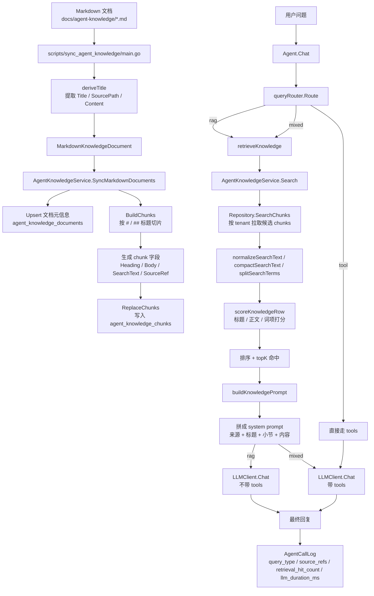

# Agent Dataflow

这份文档说明当前实现里 `Markdown -> documents/chunks -> Search -> Agent prompt` 的数据流。

对应代码：

- 导入入口：`scripts/sync_agent_knowledge/main.go`
- 切片与同步：`internal/service/agent_knowledge_service.go`
- 仓储层：`internal/repository/agent_knowledge_repository.go`
- Agent 分流与注入：`internal/agent/query_router.go`、`internal/agent/retrieval.go`、`internal/agent/agent.go`

## Mermaid



## Plain Text

```text
Markdown 文档
  -> scripts/sync_agent_knowledge/main.go
  -> deriveTitle 提取 Title / SourcePath / Content
  -> MarkdownKnowledgeDocument
  -> AgentKnowledgeService.SyncMarkdownDocuments
     -> Upsert 文档元信息到 agent_knowledge_documents
     -> BuildChunks 按 Markdown 标题切片
     -> 生成 chunk 字段:
        - Heading
        - Body
        - SearchText
        - SourceRef
     -> ReplaceChunks 写入 agent_knowledge_chunks

用户问题
  -> Agent.Chat
  -> queryRouter.Route
     -> tool  : 直接走 tools
     -> rag   : 走 retrieveKnowledge
     -> mixed : 走 retrieveKnowledge + tools

retrieveKnowledge
  -> AgentKnowledgeService.Search
     -> Repository.SearchChunks 按 tenant 拉取候选切片
     -> normalizeSearchText
     -> compactSearchText
     -> splitSearchTerms
     -> scoreKnowledgeRow
     -> 排序后取 topK

topK 命中切片
  -> buildKnowledgePrompt
  -> 生成 system prompt:
     - 来源
     - 标题
     - 小节
     - 内容

system prompt
  -> rag   : LLMClient.Chat，不带 tools
  -> mixed : LLMClient.Chat，保留 tools

最终回复
  -> AgentCallLog
     - query_type
     - source_refs
     - retrieval_hit_count
     - retrieval_duration_ms
     - llm_duration_ms
```

## One-Line Summary

`Markdown 文档 -> 同步脚本 -> 文档表/切片表 -> Search 打分取 topK -> 拼成知识 prompt -> Agent 按 rag/mixed 注入给模型 -> 生成回复并记录日志`
