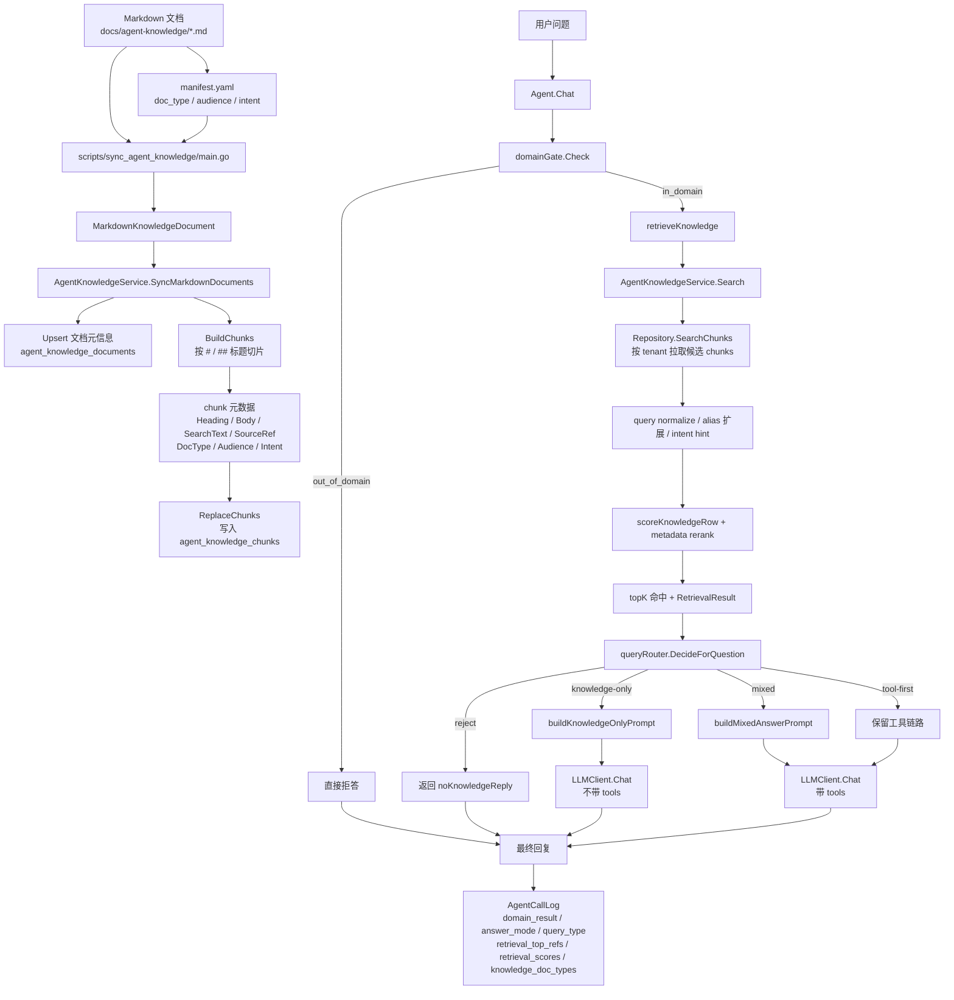

# Agent Dataflow

这份文档说明当前 retrieval-first 版本里，知识文档如何从 `docs/agent-knowledge` 进入数据库，以及 `Agent.Chat` 如何先做领域门禁、再检索知识、最后决定回答模式。

对应代码：

- 导入入口：`scripts/sync_agent_knowledge/main.go`
- 切片与同步：`internal/service/agent_knowledge_service.go`
- 仓储层：`internal/repository/agent_knowledge_repository.go`
- 领域门禁与模式决策：`internal/agent/domain_gate.go`、`internal/agent/query_router.go`
- 检索与回答编排：`internal/agent/retrieval.go`、`internal/agent/answer_builder.go`、`internal/agent/agent.go`

## Mermaid



## Plain Text

```text
知识导入
  -> scripts/sync_agent_knowledge/main.go
  -> 读取 docs/agent-knowledge/*.md + manifest.yaml
  -> 生成 MarkdownKnowledgeDocument:
     - Title
     - SourcePath
     - Content
     - Metadata(doc_type / audience / intent)
  -> AgentKnowledgeService.SyncMarkdownDocuments
     -> Upsert 文档元信息到 agent_knowledge_documents
     -> BuildChunks 按 Markdown 标题切片
     -> 为 chunk 生成:
        - Heading
        - Body
        - SearchText
        - SourceRef
        - DocType / Audience / Intent
     -> ReplaceChunks 写入 agent_knowledge_chunks

运行时问答
  -> Agent.Chat
  -> domainGate.Check
     -> out_of_domain: 直接返回职责范围外拒答
     -> in_domain: 进入 retrieval-first 检索

retrieval-first 检索
  -> AgentKnowledgeService.Search
     -> Repository.SearchChunks 按 tenant 拉取候选切片
     -> normalizeSearchText / compactSearchText / splitSearchTerms
     -> alias 扩展真实口语化问法
     -> 按标题 / 正文 / 词项打分
     -> 按 doc_type / audience / intent 轻量重排
     -> 产出 topK hits 与 RetrievalResult

模式决策
  -> queryRouter.DecideForQuestion
     -> knowledge-only: 强知识命中，且没有实时数据需求
     -> mixed: 既有知识命中，又有实时数据需求
     -> tool-first: 主要是实时查询，知识只作为辅助信号
     -> reject: 领域内但没有可用知识，也不适合走工具

回答编排
  -> knowledge-only: buildKnowledgeOnlyPrompt，禁用 tools
  -> mixed: buildMixedAnswerPrompt，要求先给实时结论，再解释规则来源
  -> tool-first: 保留原工具链路
  -> reject: 返回 noKnowledgeReply

调用观测
  -> AgentCallLog
     - domain_result
     - answer_mode
     - query_type(兼容旧口径)
     - retrieval_candidate_count
     - retrieval_top_refs
     - retrieval_scores
     - retrieval_filtered_reason
     - knowledge_doc_types
     - source_refs
     - retrieval_hit_count
     - retrieval_duration_ms
     - llm_duration_ms
```

## One-Line Summary

`Markdown + manifest -> 文档表/切片表 -> in-domain 问题默认先检索 -> 按知识命中和实时信号决定 knowledge-only/tool-first/mixed/reject -> 生成回复并记录完整检索观测`
